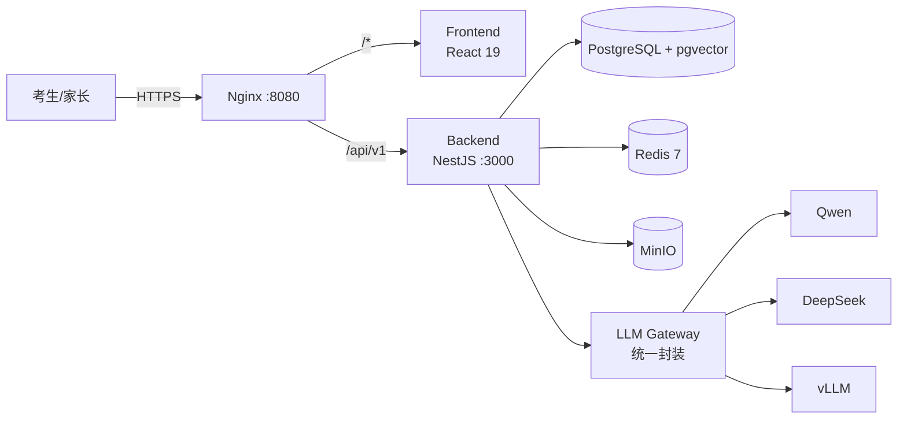

# 五邑大学国际教育学院 2026 招生 RAG 问答系统

> WYU International Education College Admissions Assistant (RAG + LLM)
> NestJS + React 19 + pgvector + 自研 LLM Gateway 的生产级招生智能问答平台,通过统一网关接入 Qwen / DeepSeek / vLLM。

---

## 项目亮点

- **RAG 检索增强**:pgvector HNSW + BGE Rerank,答案附原文引用与可点击来源
- **多 LLM 兼容**:LLM Gateway 统一封装 Qwen / DeepSeek / vLLM,业务代码零侵入切换
- **FAQ 优先命中**:相似度阈值跳过 LLM,毫秒级响应,降本
- **SSE 流式输出**:打字机式流式回答,支持来源折叠与拒答
- **知识库全链路**:文档摄取 → 解析 → 切分 → Embedding → 入库,可视化进度
- **管理后台**:FAQ / 禁答规则 / KB 版本 / 低置信度 / 用户 / 审计
- **可观测**:Prometheus 11 项核心指标 + pino requestId 全链路

---

## 快速开始(5 分钟)

### 前置

- Node.js ≥ 20
- pnpm ≥ 9(`corepack enable`)
- Docker ≥ 24 + Compose v2

### 启动

```bash
# 1) 准备环境变量
cp .env.example .env
# 至少填 LLM_API_KEY / EMBEDDING_API_KEY / JWT_ACCESS_SECRET / JWT_REFRESH_SECRET
# 生成 JWT 密钥:openssl rand -hex 32

# 2) 启动依赖(数据库 / 缓存 / 对象存储)
docker compose up -d postgres redis minio minio-init

# 3) 安装依赖
pnpm install

# 4) 数据库迁移 + 种子(创建默认管理员)
pnpm --filter backend prisma:deploy
pnpm --filter backend prisma:seed

# 5) 启动前后端
pnpm dev
```

启动后:

| 入口 | 地址 | 凭据 |
| --- | --- | --- |
| 前端 | http://localhost:8080 | — |
| 后端 API | http://localhost:3000/api/v1 | — |
| MinIO | http://localhost:9001 | minioadmin / changeme |
| 默认管理员 | — | admin / admin123(首次登录后改密) |

---

## 架构概览



详细架构、数据流、模块依赖见 [docs/architecture.md](docs/architecture.md)。

---

## 技术栈

| 层 | 选型 |
| --- | --- |
| 前端 | React 19 + Vite 5 + TypeScript 5 + Tailwind 3 + shadcn/ui + TanStack Query 5 + Zustand 5 |
| 后端 | NestJS 10 + Prisma 5 + Zod + class-validator + Pino + prom-client |
| 数据 | PostgreSQL 16 + pgvector + pg_trgm + Redis 7 + MinIO + BullMQ |
| AI | 自研 LLM Gateway + OpenAI 兼容(Qwen / DeepSeek / vLLM)+ BGE Rerank |
| 鉴权 | JWT 双 Token + argon2id + RBAC(角色 + 资源权限点) |
| 部署 | Docker Compose + Nginx + GitHub Actions + Prometheus + Grafana |

---

## 命令速查

```bash
# 根(工作区)
pnpm dev               # 前后端并行 dev
pnpm build             # 全量构建
pnpm test              # 全量测试
pnpm lint              # 全量 lint
pnpm typecheck         # 全量 tsc --noEmit

# 单独子项目
pnpm --filter backend dev
pnpm --filter frontend build

# 后端 Prisma
pnpm --filter backend prisma:generate
pnpm --filter backend prisma:deploy    # 生产迁移
pnpm --filter backend prisma:migrate   # 开发态
pnpm --filter backend prisma:seed
pnpm --filter backend prisma:studio

# Docker
docker compose up -d
docker compose logs -f backend
docker compose exec backend pnpm prisma migrate deploy
```

---

## 目录树

```
wyu-rag/
├── README.md                 # 本文件
├── docker-compose.yml        # postgres+pgvector / redis / minio / backend / frontend / nginx
├── .env.example
├── pnpm-workspace.yaml
├── nginx/
│   └── nginx.conf
├── backend/                  # NestJS 后端
│   ├── prisma/
│   │   ├── schema.prisma     # 13 张表 + 7 枚举 + 向量字段
│   │   ├── migrations/
│   │   └── seed.ts
│   ├── src/
│   │   ├── main.ts
│   │   ├── app.module.ts
│   │   ├── common/           # Guard / Interceptor / Filter / Decorator / ErrorCode
│   │   ├── config/           # Zod Env
│   │   ├── database/         # PrismaService
│   │   ├── redis/            # RedisService
│   │   ├── storage/          # MinIO StorageService
│   │   ├── llm/              # LlmService + EmbeddingService + RerankService
│   │   ├── jobs/             # BullMQ Workers
│   │   └── modules/          # auth / chat / rag / document / admin / analytics / health
│   └── package.json
├── frontend/                 # React 19 前端
│   ├── src/
│   │   ├── pages/{public,admin}/
│   │   ├── components/{ui,chat,admin}/
│   │   ├── lib/api/
│   │   ├── stores/           # zustand
│   │   └── hooks/
│   └── package.json
├── infra/
│   ├── docker/               # backend.Dockerfile / frontend.Dockerfile
│   ├── observability/        # Prometheus + Grafana JSON(占位)
│   └── scripts/              # init-pgvector.sql + 备份脚本
├── docs/
│   ├── architecture.md       # 整体架构、数据流、模块依赖、可观测性
│   ├── api.md                # 全部 HTTP 接口 + SSE 事件 + 错误码
│   ├── deployment.md         # 本地 5min / 生产 / 备份 / 扩容 / 故障
│   └── specs/wyu-iecaa-rag-qa/
│       ├── spec.md           # 完整需求规格(单一信源)
│       ├── tasks.md          # 任务清单(进度 [x] / [ ])
│       └── checklist.md      # 验收清单
└── .github/workflows/ci.yml
```

---

## 核心约定(必读)

- **统一响应**:`{ code, message, data, requestId, timestamp }`,全局 `ResponseInterceptor` 包装
- **业务异常**:抛 `BusinessException(code, message)`,code 来自 `ErrorCode` 枚举
- **LLM 调用硬约束**:**业务代码不得直接 import 厂商 SDK**,统一走 `LlmService`(review 一票否决)
- **env 校验**:所有 env 走 Zod schema,启动失败直接 crash
- **requestId**:`AsyncLocalStorage` 透传,日志 / 响应 / LLM 埋点自动带
- **认证范围**:**仅**管理员需 JWT;`/chat/*` 完全匿名,身份靠 `wyu_visitor_id` cookie
- **限流**:`RedisRateLimitGuard` 全局 60 req/min/IP

---

## 贡献指南

1. **spec-driven**:任何偏离需求先改 `docs/specs/wyu-iecaa-rag-qa/spec.md`,后改代码
2. **任务勾选**:完成 SubTask 立即在 `tasks.md` 把 `[ ]` 改 `[x]`
3. **LLM 硬约束**:不直接调厂商 SDK;`LlmService` 之外的 LLM 调用一律拒绝合并
4. **代码风格**:Prettier + ESLint(根目录 `pnpm lint` 必跑过)
5. **TypeScript 严格**:`pnpm typecheck` 0 error 才算完成
6. **测试**:Service 写单元测试,Controller 走 e2e
7. **不写多余文档**:`docs/` 已有 architecture / api / deployment,继续完善它们

---

## 文档导航

- [docs/architecture.md](docs/architecture.md) —— 整体架构、模块依赖、数据流、LLM Gateway、可观测性
- [docs/api.md](docs/api.md) —— 全部 HTTP 接口、SSE 事件、错误码
- [docs/deployment.md](docs/deployment.md) —— 本地 5min / 生产 / 备份 / 扩容 / 故障 / 安全清单
- [docs/specs/wyu-iecaa-rag-qa/spec.md](docs/specs/wyu-iecaa-rag-qa/spec.md) —— 需求规格(单一信源)
- [docs/specs/wyu-iecaa-rag-qa/tasks.md](docs/specs/wyu-iecaa-rag-qa/tasks.md) —— 任务进度
- [docs/specs/wyu-iecaa-rag-qa/checklist.md](docs/specs/wyu-iecaa-rag-qa/checklist.md) —— 验收清单

---

## 许可证

UNLICENSED —— 仅供五邑大学国际教育学院内部使用。
