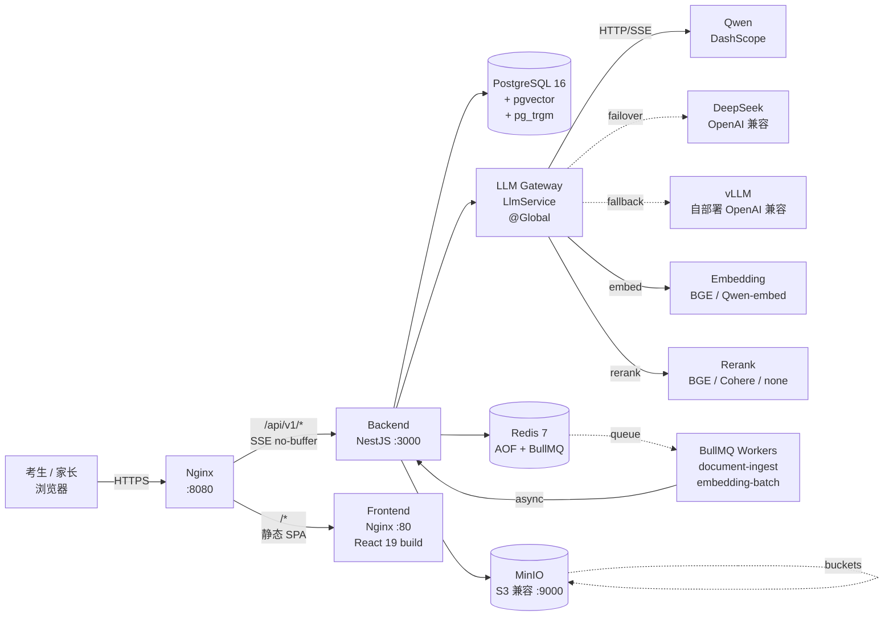
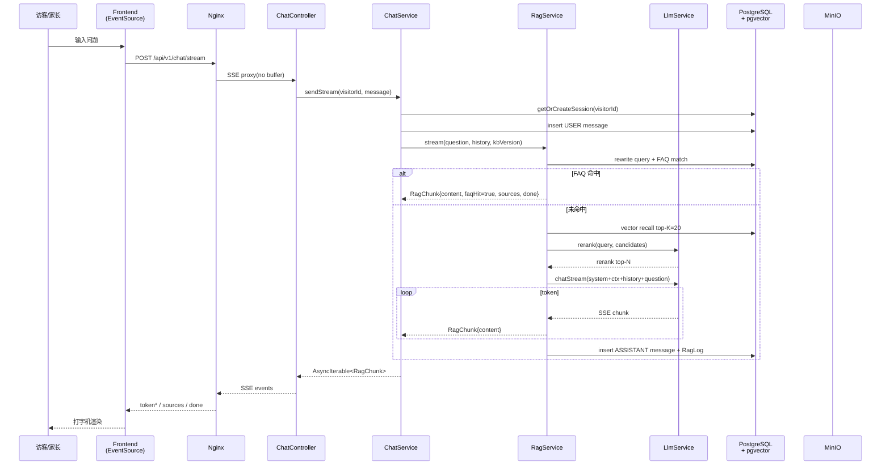
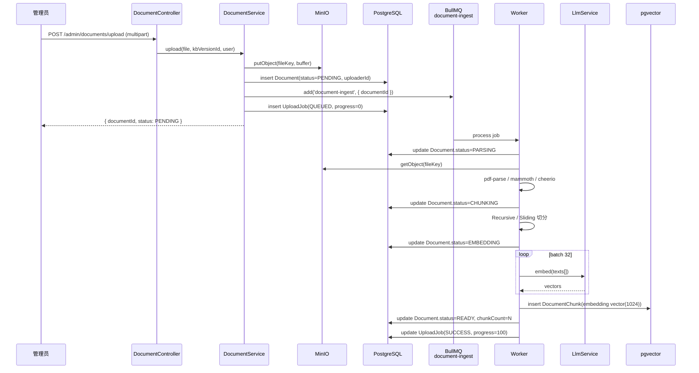
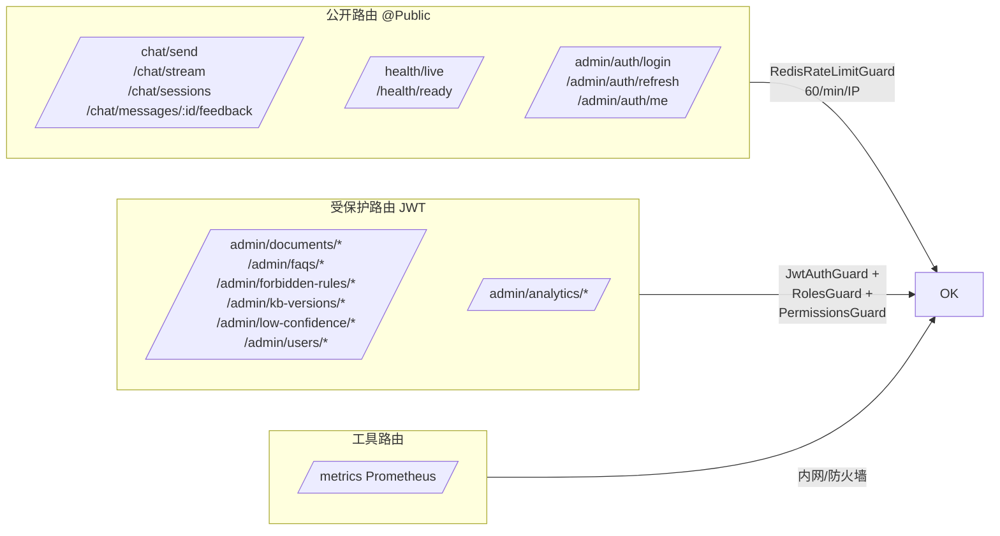

# 整体架构

> 五邑大学国际教育学院 2026 招生 RAG 问答系统 —— 架构概览
> 适用读者:新加入的开发、运维、review
> 单一信源:`docs/specs/wyu-iecaa-rag-qa/spec.md`(所有偏离需先改 spec)

---

## 1. 项目一句话

NestJS + React 19 + pgvector + 自研轻量 RAG Pipeline 的生产级招生智能问答系统。
所有 LLM 调用必须经过 **LLM Gateway**,业务代码禁止直接 import 厂商 SDK。
**认证范围**:**仅**后台管理员(operator / admin / viewer)需要 JWT 登录;家长与访客访问 `/chat/*` 完全匿名,以 `visitorId` cookie 标识身份。

---

## 2. 部署拓扑图



**关键点**:
- 单一公开入口 `Nginx:8080`,前端与后端都从这台机器出网,后端不对外暴露。
- 业务进程到 LLM 的链路是 `LlmService → axios → 厂商 OpenAI 兼容端点`,所有重试、failover、限流都在 Gateway 内完成。
- MinIO 用 S3 协议兼容,后续可平替到阿里 OSS / 腾讯 COS,仅修改 `StorageService` 实现。

---

## 3. 后端模块结构

```mermaid
graph TB
    subgraph App[app.module.ts]
        CM[CommonModule<br/>Guard/Filter/Interceptor<br/>Logger/Decorator]
        CFG[ConfigModule<br/>Zod Env]
        PR[PrismaModule<br/>PrismaService]
        RD[RedisModule<br/>RedisService]
        ST[StorageModule<br/>MinIO]
        LM[LlmModule<br/>@Global LlmService]
    end

    subgraph Biz[业务模块]
        AUTH[AuthModule<br/>admin 登录 / JWT]
        CHAT[ChatModule<br/>@Public 聊天]
        RAG[RagModule<br/>Pipeline 核心]
        DOC[DocumentModule<br/>上传/解析/索引]
        ADM[AdminModule<br/>FAQ/禁答/KB/低置信/用户]
        ANA[AnalyticsModule<br/>日志/概览/Top/趋势/CSV]
        HEA[HealthModule<br/>/live /ready]
    end

    subgraph Jobs[异步 Workers]
        DIP[document-ingest<br/>@Processor]
        EMB[embedding-batch<br/>@Processor]
    end

    CM --> AUTH
    CM --> CHAT
    CM --> RAG
    CM --> DOC
    CM --> ADM
    CM --> ANA
    CFG --> AUTH
    CFG --> LM
    PR --> AUTH
    PR --> CHAT
    PR --> RAG
    PR --> DOC
    PR --> ADM
    PR --> ANA
    RD --> CHAT
    RD --> RAG
    RD --> ADM
    ST --> DOC
    LM --> RAG
    LM --> CHAT
    LM --> DOC

    CHAT --> RAG
    ADM --> RAG
    ANA --> RAG
    DOC --> DIP
    DIP --> EMB
    EMB --> PR
```

**模块职责速查**:

| 模块 | 职责 | 入口路径 | 鉴权 |
| --- | --- | --- | --- |
| `AuthModule` | 管理员登录、JWT 双 Token、Refresh | `/api/v1/admin/auth/*` | `@Public()`(自身) |
| `ChatModule` | 家长/访客聊天、流式 SSE、会话、反馈 | `/api/v1/chat/*` | **匿名** |
| `RagModule` | Query 改写 / FAQ 命中 / 向量召回 / Rerank / Prompt / LLM / 拒答 / 落库 | 服务,无 HTTP | — |
| `DocumentModule` | 上传、解析、切分、向量化、版本、reindex | `/api/v1/admin/documents/*` | `document:read/write` |
| `AdminModule` | FAQ / 禁答 / KB 版本 / 低置信度 / 用户 | `/api/v1/admin/{faqs,forbidden-rules,kb-versions,low-confidence,users}` | 角色 + 权限点 |
| `AnalyticsModule` | 日志查询、概览、Top、趋势、CSV 导出 | `/api/v1/admin/analytics/*` | `analytics:read` |
| `HealthModule` | 存活 + 就绪探针 | `/api/v1/health/*` | `@Public()` |
| `CommonModule` | 全局 Guard/Filter/Interceptor、DTO、Decorator、限流 | — | — |

---

## 4. 数据流

### 4.1 场景 A —— 家长提问(SSE 流式)



**关键设计**:
- `RagChunk` 把"流式内容、来源、终态摘要"统一成一个对象,Controller 翻译成 SSE 事件。
- FAQ 命中时跳过 LLM,延迟 < 100ms,大幅降低 Token 成本。
- 拒答走"礼貌话术 + 引导人工",不返回编造信息,`isAnswered=false` 写入 RagLog 用于低置信度分析。

### 4.2 场景 B —— 管理员上传文档 PENDING → READY



**状态机**:`PENDING → PARSING → CHUNKING → EMBEDDING → READY`,任一阶段失败 → `FAILED(errorMessage)`。`ARCHIVED` 由删除/归档产生,不是流水线终态。

---

## 5. LLM Gateway 抽象

### 5.1 为什么需要

- **可替换性**:招生季可能因厂商限流、价格、合规随时切换 Qwen / DeepSeek / 自部署 vLLM,改 env 即可。
- **可观测性**:统一埋点 Prometheus(`llmTokensTotal` / `llmRequestDuration` / `llmErrorsTotal`)。
- **可降级**:主 Provider 5xx / 429 / 超时自动走 `LLM_FALLBACK_PROVIDERS` 链。
- **可重试**:4xx 不重试(参数问题);5xx / 429 / timeout 指数退避 3 次。
- **业务隔离**:业务代码不直接 import `openai` / `dashscope` / `deepseek` SDK,review 时 grep 不到则合规。

### 5.2 怎么用

```ts
// 业务代码只做这件事:
@Injectable()
export class RagService {
  constructor(private readonly llm: LlmService) {}

  async answer(prompt: string) {
    const stream = this.llm.chatStream({
      messages: [{ role: 'user', content: prompt }],
      temperature: 0.2,
    });
    for await (const chunk of stream) {
      // chunk.content / chunk.usage / chunk.finishReason
    }
  }
}
```

`LlmService` 内部按 `LLM_PROVIDER` env 选 OpenAI-compatible Provider,Qwen / DeepSeek / vLLM 共用同一份实现,差异只在 `baseUrl` / `apiKey` / `model`。

### 5.3 Provider 切换

```bash
# .env
LLM_PROVIDER=qwen
LLM_FALLBACK_PROVIDERS=deepseek
# 或
LLM_PROVIDER=vllm
LLM_BASE_URL=http://10.0.0.5:8000/v1
LLM_MODEL=Qwen2.5-72B-Instruct
```

切换不需要重新构建镜像,只重启 backend pod 即可生效。

---

## 6. 鉴权边界



**三套 Guard 链**:
1. `JwtAuthGuard` —— 默认全局,`@Public()` 短路;`/chat/*` 整类加 `@Public()`。
2. `RolesGuard` —— `Role.name in ['admin','operator','viewer']`,方法级 `@Roles(...)` 覆盖类级。
3. `PermissionsGuard` —— 资源级细粒度,如 `kb:write`、`document:read`,支持通配 `*` 与 `scope:*`。

**Cookie 体系**:
- 家长端没有登录态,身份靠 `wyu_visitor_id` HttpOnly Cookie + Server 端 `VisitorIdMiddleware` 双源校验,防伪造。
- 管理员 Refresh Token 支持 body / cookie / header 三路投递(兼容移动端),Access Token 15min,Refresh Token 7d,Refresh 走轮换。

---

## 7. 可观测性

### 7.1 PromService 指标语义

| 指标名 | 类型 | 标签 | 含义 |
| --- | --- | --- | --- |
| `http_requests_total` | Counter | method, route, status | HTTP 请求量 |
| `http_request_duration_seconds` | Histogram | method, route | 端到端延迟分位 |
| `rag_pipeline_duration_seconds` | Histogram | stage | 各阶段延迟(rewrite/recall/rerank/llm) |
| `rag_recall_total` | Counter | kbVersion | 召回条目数 |
| `rag_faq_hit_total` | Counter | — | FAQ 命中次数 |
| `rag_reject_total` | Counter | reason | 拒答次数(规则名/相似度/检索为空) |
| `llm_tokens_total` | Counter | provider, model, kind | Token 消耗(prompt/completion) |
| `llm_request_duration_seconds` | Histogram | provider, model | LLM 端到端耗时 |
| `llm_errors_total` | Counter | provider, code | LLM 错误计数(429/5xx/timeout) |
| `bullmq_jobs_total` | Counter | queue, status | BullMQ 任务统计 |
| `bullmq_queue_size` | Gauge | queue | 队列积压 |

### 7.2 告警建议阈值

| 指标 | 阈值 | 持续时间 | 渠道 |
| --- | --- | --- | --- |
| HTTP 5xx 率 | > 1% | 5min | 钉钉 / 飞书 |
| P95 延迟 | > 5s | 5min | 钉钉 / 飞书 |
| LLM 失败率 | > 5% | 10min | 邮件 + 钉钉 |
| BullMQ 队列积压 | > 1000 | 5min | 邮件 |
| `rag_reject_total` 增长率 | > 50/min | 10min | 邮件(可能是知识库空) |
| `rag_faq_hit_total` 占比 | < 20% (周) | — | 周报 |

---

## 8. 技术选型理由

| 选型 | 理由 | 替代方案与放弃原因 |
| --- | --- | --- |
| **NestJS 10** | 模块化 / DI / 装饰器 / Guard 链与企业项目契合,招聘市场供给充足 | Fastify(生态弱)/ Express(裸写) |
| **Prisma 5** | 类型安全 + migration 可视化 + 与 pgvector 通过 `Unsupported` 字段打通 | TypeORM(类型推断弱)/ Drizzle(2026 仍偏新) |
| **pgvector** | 单一 PG 实例承担业务 + 向量,运维成本低;HNSW 索引性能满足 TopK=20 | Milvus / Qdrant(单独一套集群) |
| **Redis 7 + BullMQ** | 一份基础设施兼顾缓存 / 限流 / 队列,API 简单 | RabbitMQ / Kafka(运维成本高) |
| **MinIO** | S3 兼容,本地能跑,后续可平替到对象存储 OSS/COS | 直接存本地(无版本/无签名) |
| **JWT 双 Token** | 7d Refresh + 15min Access,移动端 + Web 同源 | OAuth2(本项目无需第三方登录) |
| **pino** | 高性能结构化 JSON,自带 requestId 串联 | winston(慢) |
| **自研 LLM Gateway** | 业务依赖收敛,review 可一刀切,后续 vLLM 切换零代码改动 | LangChain.js(过重、绑定深、版本不兼容) |
| **@langchain/textsplitters(仅切分)** | 复用其 Recursive / Sliding 实现,避免自己重写 | 自己写(成本高) |
| **shadcn/ui + Tailwind** | 复制源码可改、原子化样式、生产包小 | MUI(包大)/ Ant Design(品牌) |

---

## 9. 安全要点

- **HTTPS**:`Nginx` TLS 终止,`Strict-Transport-Security` 强制 HTTPS。
- **JWT Secret**:`openssl rand -hex 32` 生成,production 必填,绝不入仓。
- **限流**:`RedisRateLimitGuard` 全局 60 req/min/IP,可在方法级 `@RateLimit(...)` 覆盖。
- **上传白名单**:`FileInterceptor` 限制 `fileSize: 50MB`,`MIME` 在 Service 内二次校验(只允许 pdf/docx/md/html)。
- **日志脱敏**:pino 序列化器对 `Authorization` / `Cookie` / `password*` 字段做 `[REDACTED]`。
- **审计**:`AdminService.recordAction` 统一写 `AuditLog`,失败降级 warn 不阻断主流程。
- **依赖审计**:CI 跑 `pnpm audit --prod`,Dependabot 周更 PR。
- **CORS**:`CORS_ORIGIN` 精确配置域名,不开放 `*`(生产)。

---

## 10. 目录约定(后端)

```
backend/src/
├── main.ts                       # 启动入口
├── app.module.ts                 # 模块注册
├── common/                       # CommonModule
│   ├── filters/                  # AllExceptionsFilter
│   ├── interceptors/             # ResponseInterceptor / RequestContextInterceptor
│   ├── guards/                   # JwtAuthGuard / RolesGuard / PermissionsGuard
│   ├── decorators/              # @Public / @Roles / @Permissions / @CurrentUser / @VisitorId
│   ├── pipes/                    # ZodValidationPipe
│   ├── errors/                   # BusinessException + ErrorCode
│   └── response/                 # 统一响应包装
├── config/                       # Zod Env + ConfigModule
├── database/                     # PrismaService
├── redis/                        # RedisService
├── storage/                      # StorageService (MinIO)
├── llm/                          # LLM Gateway(@Global)
│   ├── llm.service.ts
│   ├── llm.module.ts
│   ├── providers/                # openai-compatible / qwen / deepseek / vllm
│   ├── embedding/                # EmbeddingService
│   ├── rerank/                   # RerankService
│   └── types.ts
├── jobs/                         # BullMQ Workers
│   ├── processor.decorator.ts    # 自研 @Processor
│   ├── processor-registry.ts
│   ├── document-ingest.processor.ts
│   └── embedding-batch.processor.ts
└── modules/                      # 业务模块(8 个)
    ├── auth/                     # AuthController / AuthService
    ├── chat/                     # ChatController / ChatService / visitor-id.middleware.ts
    ├── rag/                      # RagService + rewriter/recall/reranker/faq/forbidden 子目录
    ├── document/                 # DocumentController + parsers/ + chunkers/
    ├── admin/                    # faq / forbidden-rule / kb-version / low-confidence / user-admin
    ├── analytics/                # 日志 + 概览 + 趋势 + CSV
    ├── health/                   # /live /ready
    ├── feedback/                 # 占位(由 ChatModule.feedback 代理)
    ├── forbidden/                # 占位(由 RagModule.forbidden 调用)
    └── kb/                       # 占位(由 DocumentModule 共享模型)
```

---

## 11. 与前端的契约

| 端点 | 用途 | 鉴权 |
| --- | --- | --- |
| `POST /api/v1/chat/stream` | 家长聊天 | 匿名 + visitorId |
| `GET  /api/v1/chat/sessions` | 访客会话列表 | 匿名 + visitorId |
| `POST /api/v1/chat/messages/:id/feedback` | 反馈 | 匿名 + visitorId |
| `POST /api/v1/admin/auth/login` | 管理员登录 | 公开 |
| `GET  /api/v1/admin/auth/me` | 当前用户 | JWT |
| `POST /api/v1/admin/documents/upload` | 文档上传 | JWT + `document:write` |
| `GET  /api/v1/admin/analytics/overview` | 概览 | JWT + `analytics:read` |

完整字段定义见 [docs/api.md](api.md)。

---

## 12. 后续规划

- **Task 7** DocumentModule 上传/解析/切分/Embedding 全链路(LLM + BullMQ + Storage 已就绪)。
- **Task 8 + 9** RagModule Pipeline + ChatModule 流式接口(家长端可见)。
- **Task 13** 前端 React 19 + shadcn/ui,先把受保护路由 + 文档管理拉起来。
- **Task 14** 观测补全(Grafana JSON + Alertmanager 规则)。
